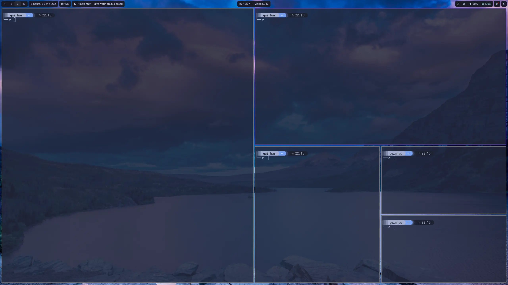
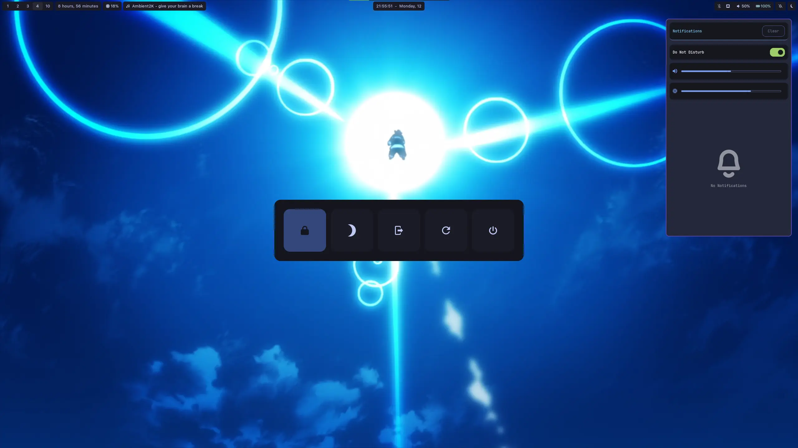

## DotFiles in laptop

Running **Fedora Linux 43** with **swaywm**.
Main apps:
- *Terminal*: Alacritty
- *Shell*: Fish
- *Prompt*: Starship
- *App Launcher*: Rofi
- *Bar*: Waybar
- *Notifications*: Swaync
- *Lockscreen*: Hyprlock 
- *Resource Monitor*: Btop
- Audio Visualizer: Cava
- Clock: ttyclock
- *Fonts*: Mainly Fonts from [NerdFonts website](https://www.nerdfonts.com/)
## Autotilling windows

## Floating windows

## Powermenu and Notification Center

## Locked Screen

#### Some important extra notices:
- Sway does note have a default autotilling option, right now I'm using [this one](https://github.com/nwg-piotr/autotiling) 
- There's a script chaging the wallpaper every 30 mins on sway/startup, hyprlock wallpaper changes accordingly.
- Powermenu (check image 3) is written using rofi and a shell script.
